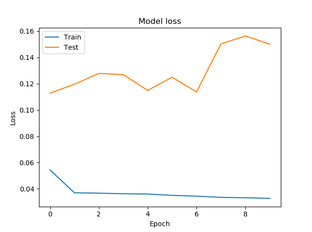

# Analytics

Complex brain activity can be decomposed into a combination of multiple sinusoid frequencies (which add up to create the complex brain activity). These simple frequency components tell us what patterns of activity are occurring across the brain – such as slow wave-like increases and decreases, or fast and highly active patterns.

# Types of Brain waves
DELTA WAVES (.5 TO 3 HZ)
Delta Waves, the slowest but loudest brainwaves
Delta brainwaves are slow, loud brainwaves (low frequency and deeply penetrating, like a drum beat). They are generated in deepest meditation and dreamless sleep. Delta waves suspend external awareness and are the source of empathy. Healing and regeneration are stimulated in this state, and that is why deep restorative sleep is so essential to the healing process.

THETA WAVES (3 TO 8 HZ)
Theta brainwaves, occur in sleep and are also dominant in deep meditation.
Theta brainwaves occur most often in sleep but are also dominant in deep meditation. Theta is our gateway to learning, memory, and intuition. In theta, our senses are withdrawn from the external world and focused on signals originating from within. It is that twilight state which we normally only experience fleetingly as we wake or drift off to sleep. In theta we are in a dream; vivid imagery, intuition and information beyond our normal conscious awareness. It’s where we hold our ‘stuff’, our fears, troubled history, and nightmares.

ALPHA WAVES (8 TO 12 HZ)
Alpha brainwaves occur during quietly flowing thoughts, but not quite meditation.
Alpha brainwaves are dominant during quietly flowing thoughts, and in some meditative states. Alpha is ‘the power of now’, being here, in the present. Alpha is the resting state for the brain. Alpha waves aid overall mental coordination, calmness, alertness, mind/body integration and learning.

BETA WAVES (12 TO 38 HZ)
Beta brainwaves are present in our normal waking state of consciousness.
Beta brainwaves dominate our normal waking state of consciousness when attention is directed towards cognitive tasks and the outside world. Beta is a ‘fast’ activity, present when we are alert, attentive, engaged in problem solving, judgment, decision making, or focused mental activity.

GAMMA WAVES (38 TO 42 HZ)
Gamma brainwaves are the fastest of brain waves and relate to simultaneous processing of information from different brain areas
Gamma brainwaves are the fastest of brain waves (high frequency, like a flute), and relate to simultaneous processing of information from different brain areas. Gamma brainwaves pass information rapidly and quietly. The most subtle of the brainwave frequencies, the mind has to be quiet to access gamma. 

# Processing
Neurable returns data with time stamp, sensory data, eye position, and brain activty. In this context we are only concerned with sensory data which will reveal the mental state of the user. I've used multilyaer preceptron to analyze brain data and classify the mental state of the user. Data classified into 4 mental state 'Stressed', 'Calm', 'Attention', 'Fatigue'.

Model takes in 6 inputs from six sensors of Neurable. It is then passed through 2 fully connected hidden layer with 'relu' activation. I've used dropout layer to prevent overfitting. There are 5 node in output layer with 'softmax' activation so we have probability of all the metal state.

# Model

Training
 
